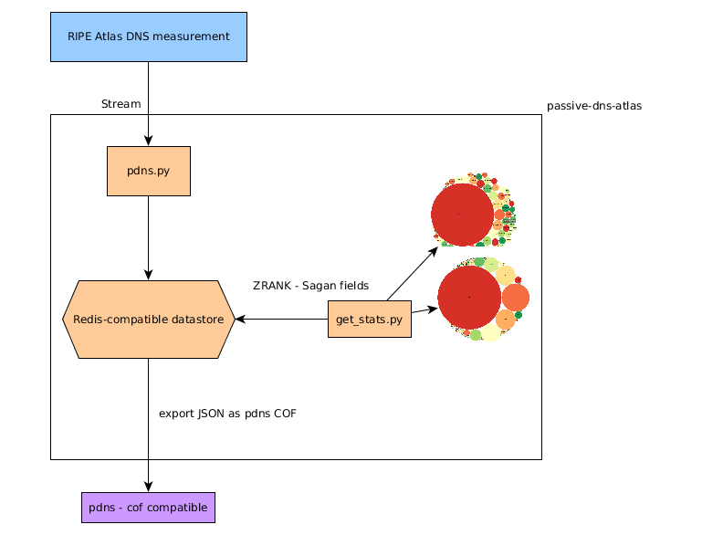
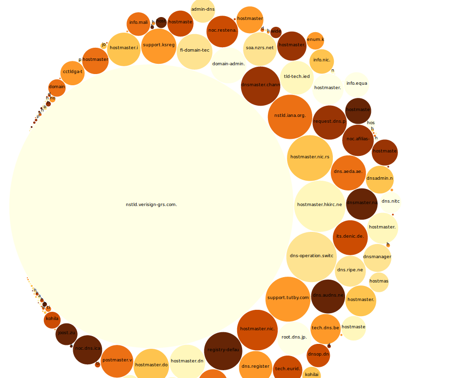

# passive-dns-atlas

Passive DNS collection (and statistics) from RIPE Atlas Sensors

The goal is to use RIPE Atlas Sensors as a source of DNS information for passive collection but also to provide
additional information and statistics to Passive DNS users from the DNS measurements performed by the RIPE Atlas sensors.

# Requirements

- Python 3
- [ripe.atlas.cousteau](https://github.com/RIPE-NCC/ripe-atlas-cousteau)
- [ripe.atlas.sagan](https://github.com/RIPE-NCC/ripe.atlas.sagan)
- Redis compatible server
- RIPE Atlas API key

# Usage

## Feeding the system

The default `atlas_result` stream is used and only the current `dns` measurement is gathered.

Don't forget to set your API key for Atlas via `ripe-atlas configure --set authorisation.create=MY_API_KEY`.

~~~~
python3 pdns.py --help
usage: pdns.py [-h] [-d] [-t TIMEOUT]

passive-dns-atlas

optional arguments:
  -h, --help            show this help message and exit
  -d, --debug
  -t TIMEOUT, --timeout TIMEOUT
                        set atlas stream timeout, default is 400 sec
~~~~

In parallel, you can generate statistics from the `dns` measurement gathered.

~~~~
python3 get_stats.py --help
usage: get_stats.py [-h] [-t] [-c] [-l LIMIT] [-o OUTPUTDIR] [-s SKIP]

passive-dns-atlas statistics extractor

optional arguments:
  -h, --help            show this help message and exit
  -t, --table           Dump statistics table in ASCII
  -c, --csvd3js         Generate D3.js Bubble Chart
  -l LIMIT, --limit LIMIT
                        Limit of values to export per ZRANK - default 100
  -o OUTPUTDIR, --outputdir OUTPUTDIR
                        Output directory
  -s SKIP, --skip SKIP  Skip a specific value from the statistics
~~~~

Specific values can be skip to avoid these in the statistics like `--skip 0 --skip 86400`.

# Current Statistics

`get_stats.py -t`

~~~~
+----------------------+-------+
| Number of occurences |  TYPE |
+----------------------+-------+
|       2872619        |  TXT  |
|       1269079        |  SOA  |
|        28912         |   A   |
|         1353         | CNAME |
|         1005         |   MX  |
|         468          |  AAAA |
|         400          |   NS  |
|          21          | RRSIG |
|          12          |  PTR  |
+----------------------+-------+
....
~~~~

`get_stats.py -c --skip 0` generates a series of CSV files that can be ingested in D3.js bubble chart view.

Some more sample statistics available at [https://www.foo.be/ripe-atlas](https://www.foo.be/ripe-atlas) generated during the hackathon.

# License

~~~~
    passive-dns-atlas - a set of tool to gather RIPE Atlas Stream DNS measurement to do statistics and populate other Passive DNS.

    Copyright (C) 2017  Alexandre Dulaunoy

    This program is free software: you can redistribute it and/or modify
    it under the terms of the GNU Affero General Public License as published
    by the Free Software Foundation, either version 3 of the License, or
    (at your option) any later version.

    This program is distributed in the hope that it will be useful,
    but WITHOUT ANY WARRANTY; without even the implied warranty of
    MERCHANTABILITY or FITNESS FOR A PARTICULAR PURPOSE.  See the
    GNU Affero General Public License for more details.

    You should have received a copy of the GNU Affero General Public License
    along with this program.  If not, see <http://www.gnu.org/licenses/>.

~~~~
 
